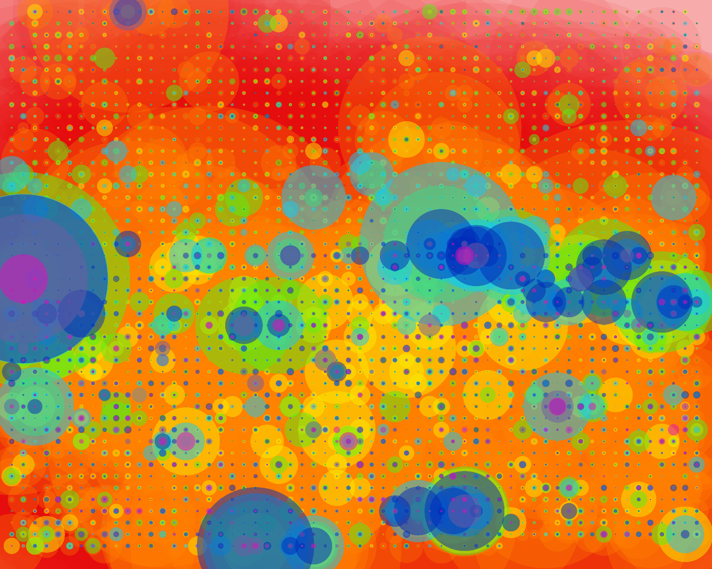
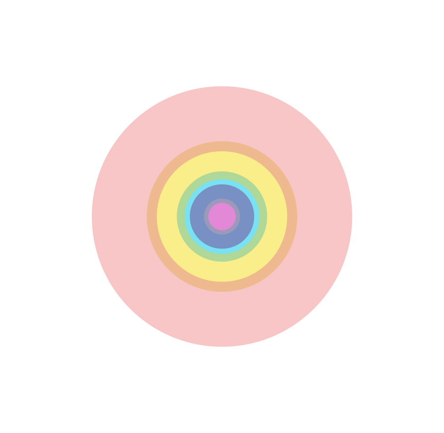
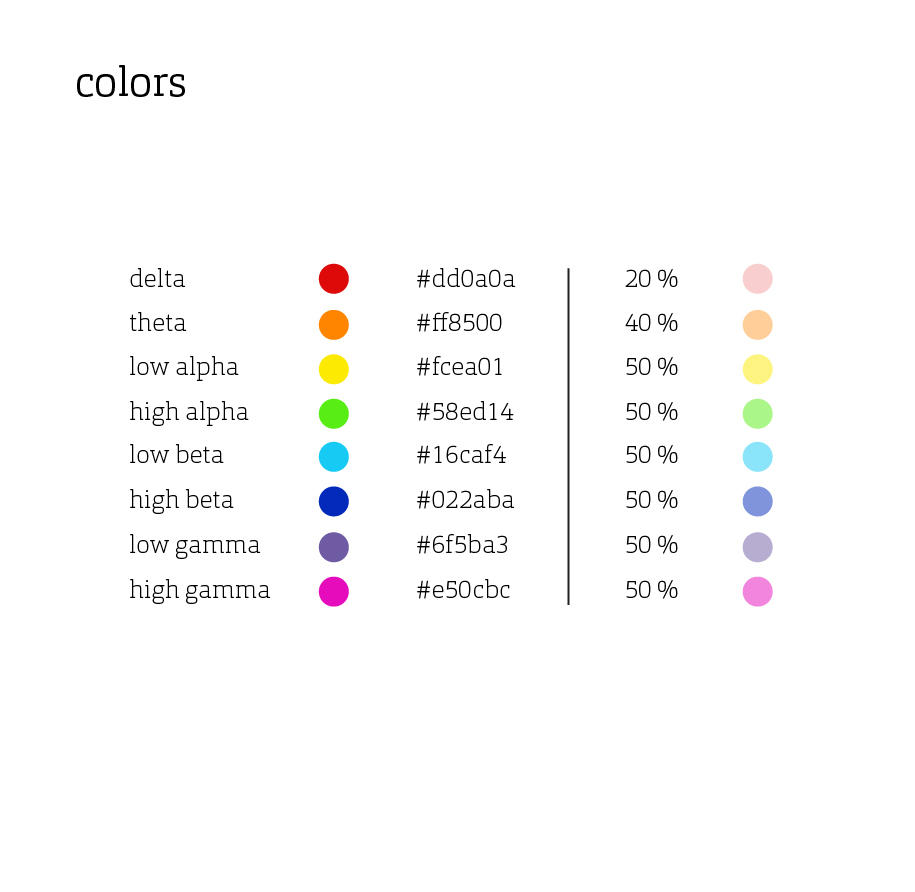
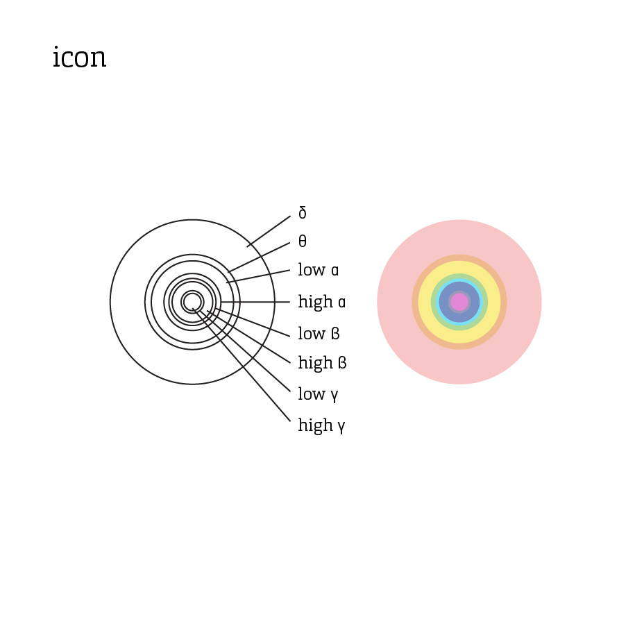
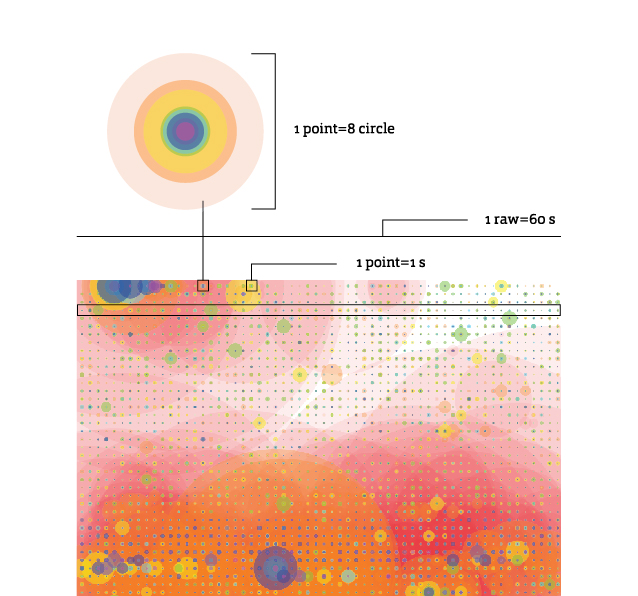
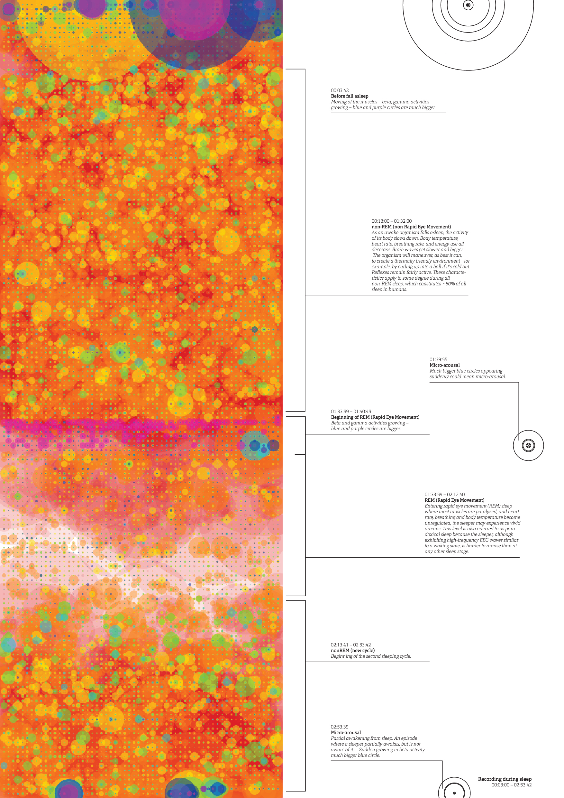
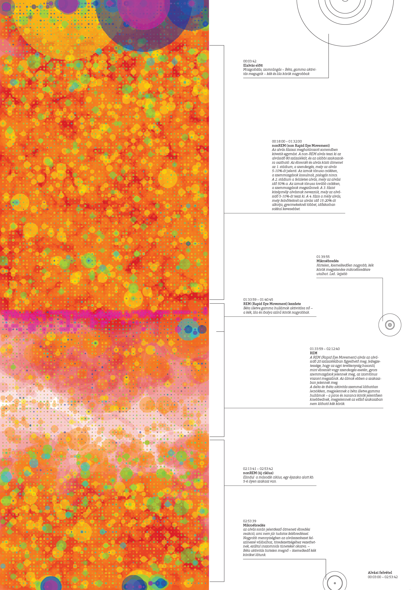
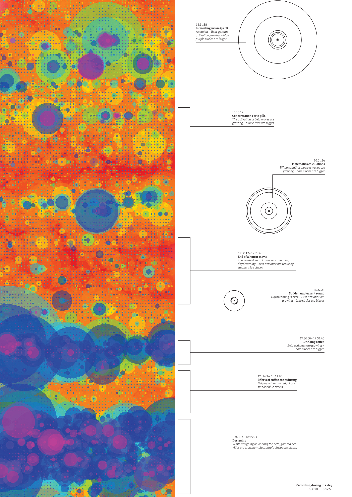
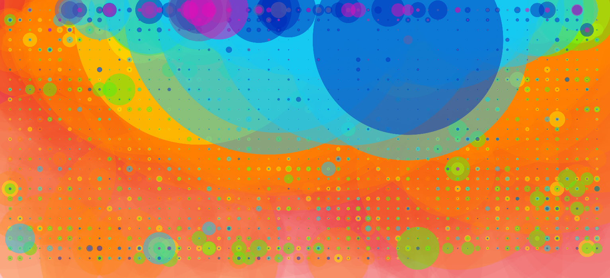

# EEG Dashboard Design

The EEG dashboard is designed to provide real-time visualization and analysis of brainwave data. This document showcases the design inspiration and visual direction for the dashboard interface.

## Banner Options

*Primary banner design showing brainwave visualization*

*Alternative banner design with neural network visualization*

## Brainwave Visualization

*Real-time brainwave visualization concept*

## Color Scheme

*Dashboard color scheme and visual hierarchy*

## Icon Design

*FlowState application icon design*

## Measurement Displays

### Compact View

*Compact measurement visualization*

### Detailed Views

*Expanded measurement display with detailed metrics*

*Advanced visualization with multiple data streams*

*Time-series data visualization with annotations*

*Multi-channel EEG visualization with spectral analysis*

## Meditation State Display

*Meditation state visualization and progress tracking*

## Implementation Notes

1. The dashboard will use a responsive grid layout to accommodate different screen sizes
2. Real-time data visualization will be implemented using WebGL for optimal performance
3. Color scheme follows accessibility guidelines for readability
4. Interactive elements will provide detailed tooltips and contextual information
5. State transitions will be animated smoothly to avoid jarring updates

## Technical Requirements

- WebGL for high-performance visualizations
- Real-time data streaming capabilities
- Responsive grid system
- Cross-browser compatibility
- Touch-friendly interface for tablet use
- Dark mode support
- Configurable refresh rates
- Data export functionality
