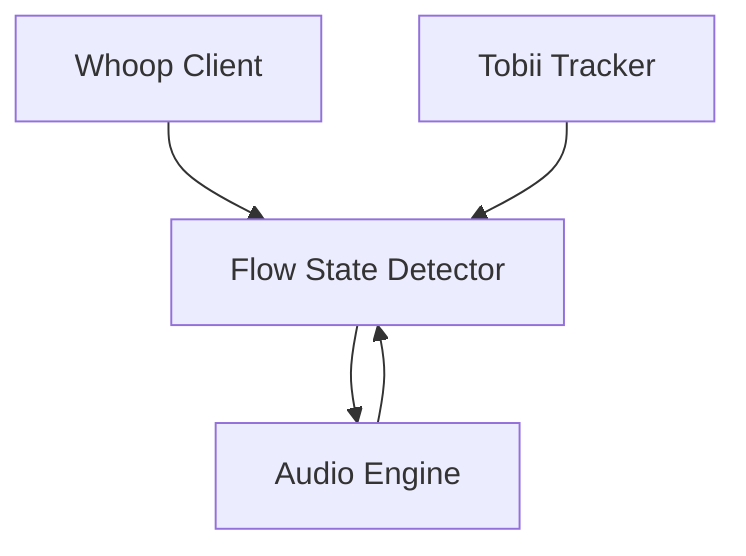

# FlowState Features & Implementation Status

## Core Systems

### 1. Neural Entrainment System
- Status: Completed 
- Priority: P1
- Implementation Files:
  - Core: [backend/core/algorithms/flow/visual_stimulation.py](../backend/core/algorithms/flow/visual_stimulation.py)
  - Hardware Interface: [backend/core/inputs/hardware_interface.py](../backend/core/inputs/hardware_interface.py)
Features:
  - Basic Neural Entrainment
  - Binaural beat generation
  - Visual frequency matching
  - Phase alignment
  - Strobe glasses hardware interface
  - Bilateral stimulation
  - Cross-hemisphere synchronization
  - Advanced strobing patterns
  - Independent eye control

Planned Enhancements:
- Machine learning-based pattern optimization
- Real-time adaptation to neural feedback
- Multi-modal stimulation coordination
- Personalized entrainment profiles

### 2. Flow State Detection & Stability
- Status: In Progress 
- Priority: P2
- Impact Score: 9.3/10
- Implementation Files:
  - Core: [backend/core/algorithms/flow/stability_system.py](../backend/core/algorithms/flow/stability_system.py)
  - State Detection: [backend/core/algorithms/realtime/state_detection.py](../backend/core/algorithms/realtime/state_detection.py)
Features:
  - Real-time flow state monitoring
  - Dynamic stability maintenance
  - Progressive challenge scaling
  - Environmental optimization
  - Real-time state detection
  - Neural coherence calculation
  - Transition detection

Planned Enhancements:
- Advanced flow state prediction
- Multi-modal flow indicators
- Early exit detection
- Flow depth analysis

### 3. Attention Density Maximizer
- Status: Completed 
- Priority: P5
- Impact Score: 7.0/10
- Implementation Files:
  - Core: [backend/core/algorithms/flow/attention_maximizer.py](../backend/core/algorithms/flow/attention_maximizer.py)
  - YouTube Integration: [backend/core/algorithms/flow/youtube_focus.py](../backend/core/algorithms/flow/youtube_focus.py)
Features:
  - Real-time attention scoring
  - Distraction detection
  - Dynamic frequency modulation
  - Eye tracking integration
  - EEG data integration

### 4. Recovery and Integration System
- Status: Completed 
- Priority: P3
- Impact Score: 7.9/10
- Implementation Files:
  - Core: [backend/core/algorithms/flow/recovery_system.py](../backend/core/algorithms/flow/recovery_system.py)
  - Health Tracking: [backend/core/inputs/health/tracking.py](../backend/core/inputs/health/tracking.py)
Features:
  - Post-flow cool-down protocols
  - Neural plasticity enhancement
  - Recovery metric tracking
  - Adaptive rest scheduling

Planned Enhancements:
- Personalized recovery protocols
- Sleep optimization integration
- Nutrition recommendations
- Recovery prediction

### 5. Chaos System
- Status: Completed 
- Implementation Files:
  - Core: [backend/core/algorithms/flow/chaos_system.py](../backend/core/algorithms/flow/chaos_system.py)
Features:
  - Global chaos control
  - Parameter-specific chaos injection
  - Multiple chaos generators
  - Pattern learning

### 6. EEG Foundation
- Status: In Progress 
- Priority: P1 (Critical Path)
- Impact Score: 10/10
Features:
  - Real-time signal processing
  - Band power calculation
  - Robust artifact rejection
  - Cross-channel coherence analysis
  - Alpha/Theta optimization
  - State classification

### 7. Attention Density Maximizer
- Status: Completed 
- Priority: P5
- Impact Score: 7.0/10
Features:
  - Real-time attention scoring
  - Distraction detection
  - Dynamic frequency modulation
  - Eye tracking integration
  - EEG data integration

### 8. Recovery and Integration System
- Status: Completed 
- Priority: P3
- Impact Score: 7.9/10
Features:
  - Post-flow cool-down protocols
  - Neural plasticity enhancement
  - Recovery metric tracking
  - Adaptive rest scheduling

Planned Enhancements:
- Personalized recovery protocols
- Sleep optimization integration
- Nutrition recommendations
- Recovery prediction

### 9. Research System
- Status: Completed 
Features:
  - Automated research aggregation
  - Activity-recovery correlation
  - Pattern effectiveness tracking
  - Knowledge base expansion

Planned Enhancements:
- Research paper summarization
- Automated literature review
- Research trend analysis
- Impact factor tracking

### 10. Biometric Integration
#### Whoop Client (biometric/whoop_client.py)
- Status: Completed 
- Priority: P1 (Critical Path)
- Impact Score: 10/10
Features:
  - Heart rate monitoring
  - HRV tracking
  - Sleep analysis
  - Recovery metrics
  - Strain calculation

#### Tobii Tracker (biometric/tobii_tracker.py)
- Status: Completed 
- Priority: P1 (Critical Path)
- Impact Score: 10/10
Features:
  - Gaze tracking
  - Attention metrics
  - Cognitive load estimation
  - Strobe synchronization
  - Saccade prediction

## Integration Features

### 1. Hardware Integration
- Status: Completed 
- Implementation Files:
  - Whoop Integration: [backend/core/inputs/health/whoop_client.py](../backend/core/inputs/health/whoop_client.py)
  - Tobii Integration: [backend/core/inputs/health/tobii_client.py](../backend/core/inputs/health/tobii_client.py)
  - Hardware Interface: [backend/core/inputs/hardware_interface.py](../backend/core/inputs/hardware_interface.py)
Features:
  - Whoop API integration
  - Tobii eye tracker integration
  - EEG device integration
  - Strobe glasses control

Planned Enhancements:
- Additional EEG device support
- Heart rate variability monitors
- Environmental sensors
- Additional biometric devices

### 2. Data Processing
- Status: In Progress 
- Implementation Files:
  - Core Processing: [backend/core/algorithms/realtime/processor.py](../backend/core/algorithms/realtime/processor.py)
  - State Detection: [backend/core/algorithms/realtime/state_detection.py](../backend/core/algorithms/realtime/state_detection.py)
Features:
  - Real-time EEG analysis
  - Biometric data processing
  - Activity pattern recognition
  - Performance metrics calculation

Planned Enhancements:
- Real-time machine learning
- Advanced pattern recognition
- Predictive analytics
- Anomaly detection

### 3. User Interface
- Status: Completed 
- Implementation Files:
  Frontend Components:
  - Main Monitor: [frontend/src/components/FlowStateMonitor.js](../frontend/src/components/FlowStateMonitor.js)
  - Biometric Display: [frontend/src/components/BiometricDisplay.js](../frontend/src/components/BiometricDisplay.js)
  - Brainwave Visualization: 
    - [frontend/src/components/BrainwaveBanner.tsx](../frontend/src/components/BrainwaveBanner.tsx)
    - [frontend/src/components/WaveChart.tsx](../frontend/src/components/WaveChart.tsx)
    - [frontend/src/components/Wavelet.tsx](../frontend/src/components/Wavelet.tsx)
Features:
  - Real-time monitoring dashboard
  - Session configuration interface
  - Performance visualization
  - Settings management

Planned Enhancements:
- Mobile application
- Voice control
- AR/VR integration
- Gesture control

## Technical Features

### 1. Performance Optimization
- Status: Completed 
- Implementation Files:
  - Core Helpers: [backend/core/helpers.py](../backend/core/helpers.py)
  - Settings: [backend/core/settings.py](../backend/core/settings.py)
Features:
  - Sub-millisecond synchronization
  - Adaptive parameter optimization
  - Real-time data processing
  - Efficient resource management

Planned Enhancements:
- GPU acceleration
- Distributed processing
- Edge computing support
- Battery optimization

### 2. Data Management
- Status: Completed 
- Implementation Files:
  - Base Models: [backend/core/models/base.py](../backend/core/models/base.py)
  - Health Metrics: [backend/core/models/health_metrics.py](../backend/core/models/health_metrics.py)
  - Database Schema: [backend/core/models/schema.sql](../backend/core/models/schema.sql)
Features:
  - Session data storage
  - Performance history tracking
  - Configuration management
  - Research database

### 3. Security
- Status: Completed 
- Implementation Files:
  - API Security: [backend/api/security.py](../backend/api/security.py)
  - Settings: [backend/core/settings.py](../backend/core/settings.py)
Features:
  - Secure data storage
  - API key management
  - User data protection
  - Access control

## Documentation
- Status: Completed 
- Implementation Files:
  - API Docs: [docs/api/](../docs/api/)
  - Development Docs: [docs/development/](../docs/development/)
  - User Guide: [docs/user/](../docs/user/)
Features:
  - API documentation
  - Architecture documentation
  - User guides
  - Development workflow

Planned Enhancements:
- Interactive tutorials
- Video guides
- API examples
- Best practices

## Integration Status

### Data Flow

## Upcoming Features
1. EEG Integration
2. Advanced ML Pipeline
3. Environmental Monitoring

## Version History
- v0.1.0: Initial biometric integration
- v0.2.0: Added audio engine
- v0.3.0: Implemented basic flow detection
